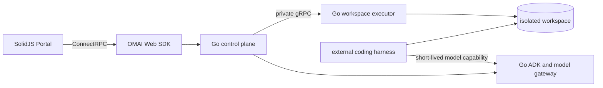

# Architecture

## Ownership

Go is the sole owner of platform state and workspace authority. The Portal
does not open files, spawn processes, manage Git repositories or call model
providers directly.



## Boundaries

- Public browser APIs use generated Protobuf messages over ConnectRPC.
- Native gRPC and reflection serve internal integrations and diagnostics.
- The private executor accepts only authenticated, capability-scoped requests.
- Workspace paths are relative to a validated project root at both transport
  hops.
- File writes use revisions and atomic replacement to prevent silent races.
- Harnesses are workers, not alternate platform backends.
- Provider credentials remain inside the Go model gateway.

## Package direction

```text
Portal -> OMAI SDK -> generated API contracts
Portal -> OMAI UI -> dependency-free platform utilities
Go transports -> application ports -> domain
Go adapters -> application ports
```

Domain and application packages do not import transport or infrastructure
adapters. Generated code is confined to transport and SDK boundaries.
