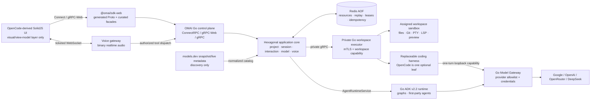

# Architecture

## Boundaries

| Layer | Responsibility | Forbidden dependency |
|---|---|---|
| Domain | OMAI entities and errors | transports, generated Protobuf |
| Application | prompt lifecycle, event normalization, catalog, voice policy | HTTP, filesystem, ADK SDK |
| Ports | repository/runtime/process contracts | concrete adapters |
| Inbound adapters | ConnectRPC mapping and status codes | business persistence |
| Outbound adapters | filesystem, Git CLI, private executor/runtime, Redis or development memory stores | browser DTO decisions |

Browser traffic terminates at the OMAI server. ConnectRPC exposes Connect JSON to the SolidJS client and gRPC/gRPC-Web from the same generated contract. The application submits normalized prompts through the `domain.Runtime` port. A remote adapter calls `AgentRuntimeService`; Go ADK is one independently deployable implementation of that service.

## Production graph

The arrows are ownership boundaries. The frontend never owns a provider key,
workspace path policy, process, session record or authorization decision.
OpenCode is not on the browser-to-platform path; when selected as a coding
harness it is a disposable guest of the private executor and receives only a
short-lived model capability.

`@omai/sdk-web` is the browser adapter for that contract, not another
application layer. Buf generates its Protobuf-ES descriptors from the same
files as the Go handlers. A small framework-neutral facade centralizes auth,
transport, error conversion, catalog validation, server streams and realtime
voice framing. It contains no provider routing, policy, session ownership,
workspace decisions or automatic write retries. SolidJS imports this package;
the migrated chat/model/health paths no longer import the duplicated RPC
client. Any remaining compatibility imports in the application repository are
frontend migration scope and are not dependencies of this backend.

## Stable platform resources

`omai.platform.v1` owns browser-facing Project and Session identity. The
session facade resolves a contained project, creates or adopts the session,
submits an explicit `(runtime, provider, model)` route, and consumes a typed
event `oneof`. The older `uab.v1` event envelope is decoded only at the runtime
compatibility edge; unknown runtime events are preserved explicitly.

Both namespaces are registered in ConnectRPC, native gRPC health, reflection
and the descriptor-derived permission registry. Generated DTOs terminate in
the inbound adapter and never enter repositories.

## Model routing boundary

The Portal selects the immutable tuple `(runtime_id, provider_id, model_id)` for
a turn. The control plane validates that tuple against its runtime-scoped
catalog before the prompt crosses the `domain.Runtime` port. The remote runtime
adapter forwards it to `AgentRuntimeService`; the ADK runtime validates it a
second time against its executable provider allowlist and stores the route in
the request context. One ADK runner can therefore preserve a session while the
model changes between turns.

There are two explicit execution modes. A graph or first-party agent calls the
Go ADK `AgentRuntimeService` directly. A coding harness runs as a guest inside a
leaf workspace executor and calls `ModelGatewayService`; the first concrete Go
driver supervises an external OpenCode CLI. The loopback compatibility edge
converts OpenAI chat/tool/media streams into portable Protobuf messages, then
the gateway converts those into ADK `model.LLMRequest` values and streams
normalized responses back. The same router instance serves both the built-in
runtime and the gateway, so keys, endpoint policy, client pooling and model
allowlists have one owner.

The harness never selects an arbitrary upstream URL or receives a provider
credential. For every turn the Go supervisor creates an opaque route and a
random capability bound to tenant, actor, session, provider and model. The
capability reaches only a loopback listener and is revoked on exit or cancel.
Native harness session identity is an adapter detail persisted outside the
workspace; OMAI session identity remains authoritative.

Model discovery and model execution are separate controls. The control plane
loads the complete vendored models.dev source snapshot, normalizes its current
provider/model metadata into Go domain records, and then attempts an hourly live
refresh. Catalog-only providers remain searchable but have no runtime and are
not selectable. Explicit routes assign Google, OpenAI and OpenRouter models to
the ADK execution runtime using the same default/prefix/allow-all policy as the
ADK router. A route may additionally authorize a coding-agent runtime such as
`opencode`; the provider key and model client still remain in Go ADK. The model
record is unique, exposes all authorized agent runtimes and carries its current
models.dev context/output limits across the private runtime contract. A model
is callable only when the catalog marks it ready and the ADK configuration
independently allows it. A refresh failure never replaces the last valid
catalog; normalized disk replacement is atomic and the Docker cache volume
preserves it across control-plane restarts.

Realtime voice is intentionally outside the provider-neutral model gateway. It
uses a long-lived bidirectional Gemini Live session, while this gateway exposes
a bounded generation stream. Voice actions still enter the same descriptor,
authorization and application boundaries.

Live audio terminates at the independently scalable `omai-voice-gateway`. Only binary audio and bounded control envelopes cross its browser WebSocket. Identity, tickets, leases, tool discovery, authorization, confirmation and execution remain owned by the control plane. Redis makes admission and tool-call idempotency consistent across gateway and control-plane replicas.

Portal-owned actions use a hard acknowledgement boundary. The control plane returns a validated `PortalCommand`; the voice gateway sends `ui_command` to SolidJS and reports success to the model only after the browser returns a matching `ui_result`. A missing, failed, or late acknowledgement is a failed tool call.

This split makes ADK upgrades replaceable and prevents vendor SDK types from entering the core. The descriptor registry scans the compiled descriptors at startup. Missing or invalid annotations on enabled tool methods fail startup, so authorization metadata and reflected tool metadata cannot silently diverge. Internal model-gateway methods are deliberately not exposed as NEO/voice tools.

## Event lifecycle

1. Resolve and contain the workspace under configured roots.
2. Resolve a tenant-scoped internal session from `(tenant, runtime, external session)`.
3. Persist the user message and publish `session.status=running`.
4. Project runtime chunks into the typed `omai.platform.v1.SessionEvent`
   algebra; the legacy envelope remains available to compatibility clients.
5. Persist assistant chunks and publish a terminal `session.status=idle`.

Every event has a monotonically increasing per-session sequence. A client reconnects with `since`; an expired replay cursor receives `OUT_OF_RANGE` instead of an incomplete history.

In production, sessions, messages and bounded event replay are Redis-backed.
A distributed compare-owner lease fences concurrent turns across control-plane
replicas; lease-renewal loss cancels the local run. Redis Pub/Sub carries live
fan-out while the durable list remains the replay authority. Permission and
question decisions are durable, tenant-scoped and idempotent; their typed
events update the existing SolidJS docks through the same session stream.

## Process boundary

Terminal and LSP contracts are registered. Terminals use a real PTY with bounded replay, per-tenant process limits, resize/input/stop lifecycle and tenant isolation. Language servers use clean stdio rather than a PTY so LSP framing is not corrupted. The built-in registry detects common Go, TypeScript, Rust, Python, C/C++, HTML, CSS and JSON servers; unavailable binaries are reported instead of being started.

The public `uab.v1` terminal/LSP services terminate in the control plane. In
development they may use the local Go process adapter. Production configuration
requires the outbound `ProcessManager` port to be wired to the private
`omai.executor.v1.WorkspaceExecutorService`; there is no local production
fallback. The separate `omai-workspace-executor` process runs the same tested Go
PTY manager inside the assigned microVM/container and exposes start/get/list,
input, resize, stop/remove, cursor-based replay/streaming and bounded one-shot
argv execution over gRPC. The Git adapter uses that command port in production;
repository discovery itself is pure filesystem inspection and does not spawn a
control-plane child process.

File bytes, SHA-256 revisions, compare-and-swap writes, Move/Delete, staged ZIP
import, streamed ZIP export, directory creation/listings, typed
file-or-directory search and file watching cross the same executor boundary.
A watch begins with a `RESYNC`
readiness event only after all requested inotify watches are installed,
eliminating the remote start race; overflow or browser backpressure also
degrades to `RESYNC` rather than silently losing changes. Linux uses
nonblocking inotify with bounded `select` cancellation so disconnected streams
release descriptors deterministically.

The SolidJS file tree and future Monaco editor are projections of this API.
Monaco holds the last read revision and sends it on save; Go returns a conflict
when a harness, terminal or another editor changed the file first. The client
must offer reload/compare, never retry a stale write automatically.

The private identity also contains a `relative_root` derived by the control
plane from `OMAI_EXECUTOR_CONTROL_ROOT`. The executor resolves it again beneath
its own mount and rejects absolute, traversing or symlink-escaping values. This
keeps a project subdirectory a project subdirectory across the remote boundary;
it can never silently become the executor's whole shared mount. One
tenant/workspace leaf remains the production isolation target.

MCP configuration is a durable Go resource with idempotent deletion. The
runtime connection, authentication and capability/resource discovery are a
separate outbound adapter boundary. An enabled record is never presented as
connected merely because it exists in Redis.

The executor repeats tenant/workspace checks and requires a distinct bearer
capability. Production leaf configuration pins exactly one tenant and workspace
and requires mutual TLS. OpenSandbox/Firecracker remains the OS security
boundary: the executor sees the assigned workspace and minimal toolchain, never
control-plane/provider secrets. The Go harness supervisor owns process groups,
turn concurrency, cancellation, model capabilities and native-session mapping.
The guest harness may exercise its native tools inside that sandbox; Go does not
claim to intercept each guest syscall. Harnesses do not become owners of OMAI
identity, placement, terminals or LLM credentials. See `HARNESS.md` for the
complete runtime path and extension contract.
