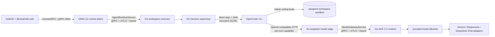

# Coding harness runtime

## Implemented boundary

The leaf workspace executor can expose a second private
`uab.v1.AgentRuntimeService`. Its Go supervisor starts one reviewed coding
harness inside the already assigned workspace sandbox. The first concrete
driver targets the OpenCode CLI; the hexagonal driver interface is deliberately
small enough for later ACP, Codex, Claude Code, Gemini CLI or custom drivers.

OpenCode is an external, operator-pinned executable. The backend neither
imports its TypeScript SDK nor embeds its server. A source checkout can be
started with an explicit command prefix, but production should use a reviewed
binary or an immutable image digest.



The OS sandbox is the syscall boundary. Go owns admission, tenant/workspace
placement, process lifecycle, cancellation, model routing and all credentials;
the guest harness may use its native coding tools only inside that sandbox.
UI-driven terminal, LSP, Git and one-shot command operations still cross the
private Go `WorkspaceExecutorService`. Go does not pretend to mediate every
syscall made by a guest process after it is inside the microVM.

## Turn lifecycle

1. The public control plane authenticates the user, resolves the internal OMAI
   session and validates `(runtime, provider, model)` against its catalog.
   A models.dev route may list `opencode` in `additional_runtime_ids`; this
   authorizes the agent runtime without changing the primary `go-adk` provider
   owner. The selected model's real context/output limits travel with the
   private runtime request.
   Harness turns fail fast when either provider or model is omitted; implicit
   provider defaults are intentionally limited to direct runtimes.
2. Its remote runtime adapter calls the pinned leaf executor. The leaf ignores
   any control-plane filesystem path and substitutes its own sandbox root.
3. The Go supervisor rejects a concurrent turn for the same OMAI or external
   session and issues a random, expiring model capability bound to tenant,
   actor, session, provider and model.
4. The OpenCode driver builds fixed argv, sends the prompt over stdin and
   supplies a minimal environment. Provider keys and control-plane secrets are
   never inherited.
5. OpenCode calls only `omai/<opaque-route>` through the loopback Go model edge.
   The edge authenticates the capability and projects OpenAI-compatible chat,
   tool, media and streaming messages into `ModelGatewayService` Protobuf.
6. Go ADK resolves the real provider/model through its independent executable
   allowlist and streams normalized model events back.
7. The driver normalizes completed text, reasoning, tool, step and error JSONL
   events into OMAI runtime events. The native OpenCode `ses_...` identifier is
   atomically persisted against the external OMAI session for the next turn.
8. Exit, cancellation or failure always revokes the model capability. Cancel
   kills the complete harness process group, not only its parent process.

## Security invariants

- The model edge must bind to IPv4/IPv6 loopback and exposes no provider key.
- A capability is 256 random bits, stored only as a SHA-256 lookup key, scoped
  to one route and revoked when the turn ends.
- The harness receives an explicit environment; ambient OpenAI, Google,
  OpenRouter, OMAI, JWT, Redis and executor secrets are not inherited.
- Prompt text goes through stdin. Titles and operator command prefixes are
  validated; no prompt is interpolated into a shell command.
- Event lines, stderr, prompt size, request body, media, schema, message, tool,
  process and concurrent-lease counts are bounded.
- The session map is an operator-owned regular file outside the workspace;
  symlinks are rejected and updates use mode `0600`, fsync and atomic rename.
- Production control-plane-to-executor and executor-to-ADK hops require TLS 1.3,
  mutual certificates and independent bearer capabilities.
- Auto-approval is off by default. Enable it only when the leaf runs as a
  non-root guest in a disposable, egress-restricted OpenSandbox/Firecracker
  boundary with CPU, memory, PID, disk and wall-time limits.

The per-turn model capability is intentionally visible to the harness process
and may therefore be visible to a child tool process. It grants only the same
model route and identity for that active turn, reaches only a loopback socket
and is revoked on completion. The microVM egress policy remains necessary to
contain arbitrary code produced by any coding agent.

## Configuration

Enable the OpenCode driver on a leaf executor:

```sh
export OMAI_HARNESS_DRIVER=opencode
export OMAI_HARNESS_COMMAND=/usr/local/bin/opencode
export OMAI_HARNESS_COMMAND_ARGS='[]'
export OMAI_HARNESS_VERSION='pinned-release-or-image-digest'
export OMAI_HARNESS_HOME=/var/lib/omai/harness
export OMAI_HARNESS_STATE_FILE=/var/lib/omai/harness/sessions.json
export OMAI_HARNESS_MODEL_EDGE_ADDR=127.0.0.1:8793
export OMAI_HARNESS_MODEL_GATEWAY_URL=https://adk.internal:8790
export OMAI_HARNESS_MODEL_GATEWAY_TOKEN='at-least-32-characters'
export OMAI_HARNESS_MODEL_GATEWAY_TRANSPORT=grpc
```

`OMAI_HARNESS_COMMAND_ARGS` is a JSON string array of fixed operator arguments.
For development against this repository's source checkout it can be
`["--conditions=browser","/absolute/path/to/packages/opencode/src/index.ts"]`
with Bun as `OMAI_HARNESS_COMMAND`. User prompts never enter this array.

The control plane registers the leaf runtime through
`configs/runtimes.harness.example.json`. In production, fill all certificate
paths on both private hops. The regular `configs/runtimes.example.json` remains
the simpler direct Go ADK configuration.

`configs/model-sync.example.json` keeps `runtime_id: "go-adk"` as the execution
owner and adds `opencode` to `additional_runtime_ids`. Catalog search and turn
validation therefore expose the same canonical provider/model IDs to either
agent runtime, without duplicating models or weakening runtime checks.

## Verification

The opt-in source E2E test runs the actual OpenCode TypeScript entrypoint. It
verifies capability-only model access, Go route identity, a real `write` tool
mutation inside a temporary workspace, denial of an attempted external write,
tool-result round-trip, normalized events, atomic native-session persistence
and a resumed second turn:

```sh
OMAI_TEST_OPENCODE_COMMAND=/absolute/path/to/bun \
OMAI_TEST_OPENCODE_ENTRY=/absolute/path/to/packages/opencode/src/index.ts \
go test ./internal/adapter/harness -run TestOpenCodeSourceEndToEnd -count=1 -v
```

The normal Go suite has no Bun dependency; the source E2E test skips unless both
variables are present.

The Linux release harness also contains an opt-in real ACP acceptance path:

```text
OpenCode ACP stdio -> Go loopback capability edge -> ModelGatewayService
  -> Go ADK 2.2 model router -> DeepSeek Chat Completions
```

Run it with `./RUN_LIVE_AUDIT.sh --bootstrap --real-deepseek-acp`. The shell
removes `DEEPSEEK_API_KEY` from its inherited environment immediately, scopes
it only to the Go ADK child, and starts the ACP probe without that variable.
The generated JSON records the ACP agent, Go route, model and sentinel result,
never the model answer or a credential. This is a release test of the ACP
contract; the deployed executor still uses the concrete JSONL driver described
above until ACP lifecycle/resume/cancellation is promoted into that runtime
port.

## Current limits

- OpenCode JSON mode emits completed text/reasoning parts, not token-by-token
  CLI deltas. ModelGateway streaming is incremental, while the normalized
  OpenCode answer event arrives when that part closes.
- The bundled session adapter is a durable atomic file for one pinned leaf, not
  a shared multi-replica database. A scheduler must preserve the leaf or replace
  this port with durable placement/session storage.
- This repository does not ship an OpenCode executable. Production images must
  add an audited, pinned binary and record its version or image digest.
- The Go boundary is implemented and tested, but hostile multi-tenant approval
  still requires the documented real OpenSandbox/Firecracker deployment and
  repeat penetration test at the OS boundary.

## Adding another harness

A driver implements only descriptor discovery, executable identity, invocation
construction and event decoding. Shared Go code retains concurrency control,
session mapping, process groups, capability issuance/revocation and runtime
transport. Prefer a stable machine protocol such as ACP or documented JSONL;
never parse colored terminal UI output. Each driver must ship contract fixtures,
resume/cancel/error tests and one real executable E2E test before it is enabled.

Only the OpenCode JSONL reference driver is enabled as a deployed executor
runtime in this release. OpenCode ACP is implemented as a real source-level
acceptance probe, not yet as the production supervisor driver. ACP-based
Codex/Claude/Gemini/Hermes runtime drivers remain extension targets, not
claimed functionality.
