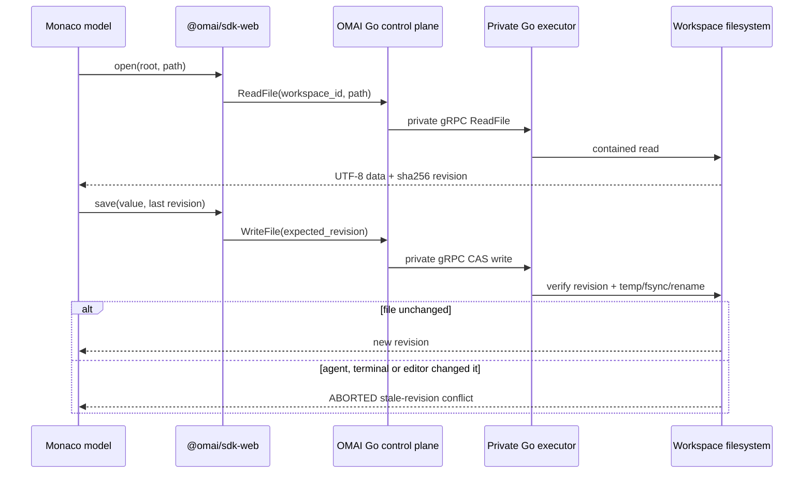

# Monaco on the Go-owned workspace

Monaco is an editor view, not a filesystem owner. The integration module is
`packages/app/src/omai/monaco-workspace.ts`.

Rules:

1. Keep the revision beside each Monaco model.
2. Save only with that revision. A new file uses `createOnly`.
3. Never auto-retry `ABORTED`; offer reload/compare to the user.
4. Subscribe to `WatchFiles`. `resync` means reload authoritative state.
5. Rename, Delete, search, Git, terminal, LSP and preview always use the same
   workspace ID and OMAI SDK; no browser filesystem or legacy HTTP endpoint is
   allowed.
